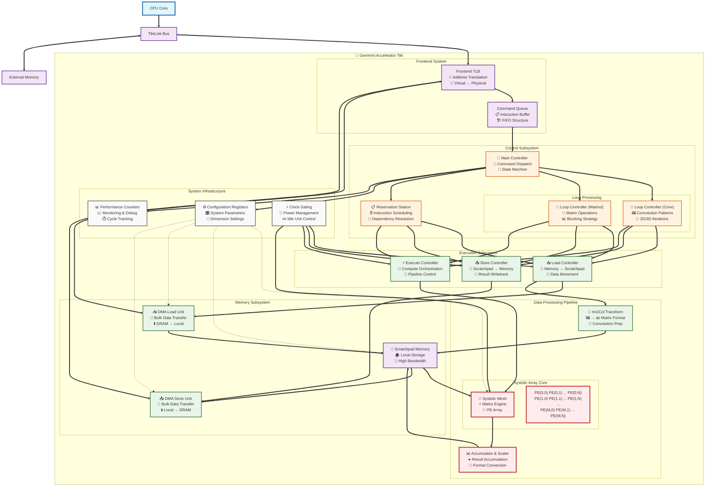

# Gemmini Architecture - Comprehensive Analysis

## Overview
This document contains a comprehensive analysis of the Gemmini accelerator architecture based on the provided internal diagram and codebase exploration.

## Architecture Diagram

## Component Analysis

### What the Original Diagram Got Right:
1. **Core Control Flow**: The command flow from Frontend → Queues → Controllers → Execution units is accurately represented
2. **Major Functional Blocks**: All the key components (ReservationStation, Controllers, Scratchpad, Im2Col, FrontendTLB) are present
3. **Memory Interface**: The connection through Frontend TLB to external memory is correctly shown
4. **Loop Structure**: The presence of loop controllers for different operation types

### Missing Elements in Original Diagram:
1. **Systolic Array Mesh**: The core compute engine was completely absent
2. **Accumulator & Scaler**: Result processing unit missing
3. **DMA Units**: Explicit DMA load/store units not shown
4. **Configuration System**: Config registers and system control missing
5. **Power Management**: Clock gating logic not represented
6. **Performance Monitoring**: Counter controllers absent
7. **Critical Datapath**: No connection from ExecuteController to compute units
8. **Result Path**: Missing path from compute units back to memory

### Key Data Flow Paths:

#### 1. Command Flow (Control Path)
- CPU → TileLink → Frontend TLB → Command Queue → Main Controller
- Controller dispatches to Loop Controllers (Conv/Matmul) and Reservation Station
- Loop Controllers and Reservation Station schedule execution units

#### 2. Load Path (Input Data)
- LoadController → DMA Load Unit ↔ Frontend TLB ↔ External Memory
- DMA Load → Scratchpad (direct data movement)
- LoadController → Im2Col → Scratchpad (transformed data for convolution)

#### 3. Compute Path (Core Processing)
- ExecuteController → Systolic Mesh
- Scratchpad → Systolic Mesh (input data)
- Systolic Mesh → Accumulator & Scaler → Scratchpad (results)

#### 4. Store Path (Output Data)
- StoreController → DMA Store Unit
- Scratchpad → DMA Store Unit → Frontend TLB → External Memory

## Component Functions

### Control Components:
- **Main Controller**: Central command dispatcher and state machine
- **Loop Controllers**: Generate complex nested loop patterns for conv/matmul operations
- **Reservation Station**: Out-of-order instruction scheduling with dependency tracking
- **Configuration Registers**: System-wide parameter storage (dimensions, formats, etc.)

### Execution Components:
- **Load/Store/Execute Controllers**: Manage the three main execution pipelines
- **Systolic Array Mesh**: Core matrix computation engine with PE array
- **Accumulator & Scaler**: Post-processing unit for result accumulation and format conversion
- **Im2Col Unit**: Transforms image data into matrix format for convolution

### Memory Components:
- **Scratchpad**: High-bandwidth local memory for operands and results
- **DMA Units**: Efficient bulk data transfer between local and external memory
- **Frontend TLB**: Address translation and memory interface

### Infrastructure:
- **Performance Counters**: Monitoring and debugging support
- **Clock Gating**: Power management for idle units

This comprehensive architecture shows how Gemmini efficiently handles both convolution and matrix multiplication workloads through a well-orchestrated pipeline of specialized units.
