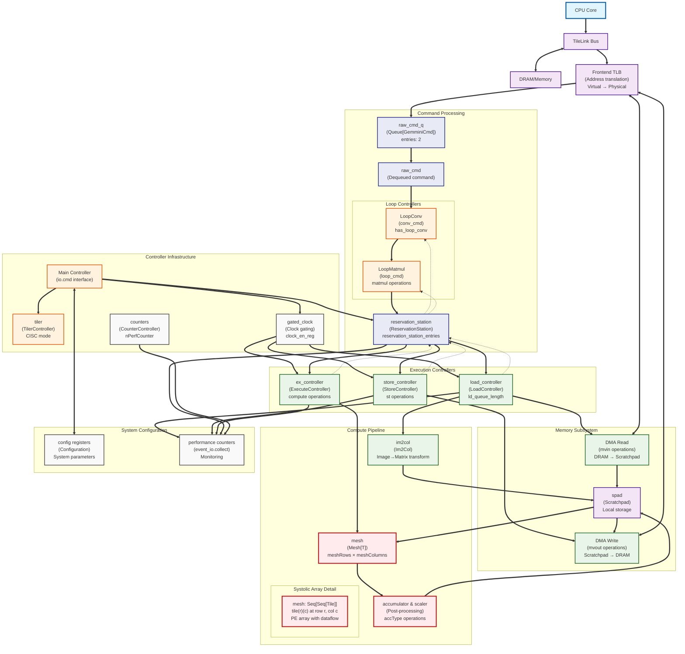

# Gemmini Architecture - Code-Accurate Variable Names

This diagram uses the actual variable names, class names, and function names from the Gemmini codebase.

## Key Variable Names and Types Used:

### Controllers (from Controller.scala):
- `load_controller: LoadController` - Manages memory load operations
- `store_controller: StoreController` - Manages memory store operations  
- `ex_controller: ExecuteController` - Manages compute operations
- `reservation_station: ReservationStation` - Instruction scheduling
- `tiler: TilerController` - CISC mode operations
- `counters: CounterController` - Performance monitoring

### Command Processing:
- `raw_cmd_q: Queue[GemminiCmd]` - Command queue with 2 entries
- `raw_cmd` - Dequeued command from queue
- `conv_cmd` - Output from LoopConv controller
- `loop_cmd` - Output from LoopMatmul controller

### Mesh and Compute:
- `mesh: Seq[Seq[Tile]]` - 2D array of tiles (from Mesh.scala)
- `tile(r)(c)` - Individual tile at row r, column c
- `meshRows`, `meshColumns` - Mesh dimensions
- `tileRows`, `tileColumns` - Tile dimensions

### Configuration Parameters:
- `reservation_station_entries` - Total reservation station size
- `reservation_station_entries_ld/ex/st` - Per-type queue sizes
- `ld_queue_length` - Load controller queue depth
- `block_rows = meshRows * tileRows` - Block dimensions
- `block_cols = meshColumns * tileColumns`

### Clock and Power:
- `gated_clock` - Clock gating for power management
- `clock_en_reg` - Clock enable register
- `withClock(gated_clock)` - Clock domain wrapping

### Performance Monitoring:
- `event_io.collect()` - Performance counter collection
- Various counter types for different operations

This version accurately reflects the actual implementation structure and naming conventions used in the Gemmini codebase.
