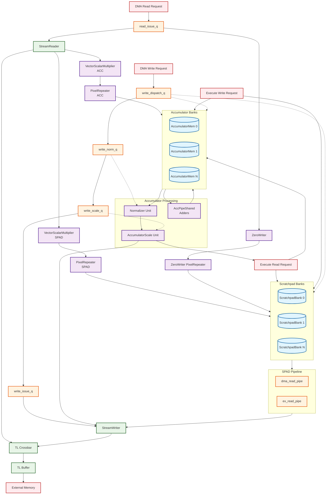

# Gemmini Scratchpad Architecture Diagram

## Key Components and Data Flow

### **Memory Hierarchy:**
- **ScratchpadBanks**: Store input data (weights, activations) 
- **AccumulatorMem**: Store partial sums and final results with accumulation capability

### **Data Movement Engines:**
- **StreamReader/Writer**: Handle DMA between external memory and internal banks
- **VectorScalarMultiplier**: Apply scaling transformations to data
- **PixelRepeater**: Handle pixel repetition for convolution optimizations

### **Control Pipeline:**
- **Queue Chain**: `write_dispatch_q → write_norm_q → write_scale_q → write_issue_q`
- **Processing Chain**: `Normalizer → AccumulatorScale → Output`

### **Dual Access Paths:**
1. **DMA Path**: External Memory ↔ StreamReader/Writer ↔ Banks
2. **Execute Path**: Processing Elements ↔ Direct Bank Access

### **Key Features:**
- **Bank arbitration** between DMA and Execute controller access
- **Pipelined operations** with multiple queue stages  
- **Data transformation** integrated into the data movement path
- **Shared accumulator adders** for efficient accumulation operations
